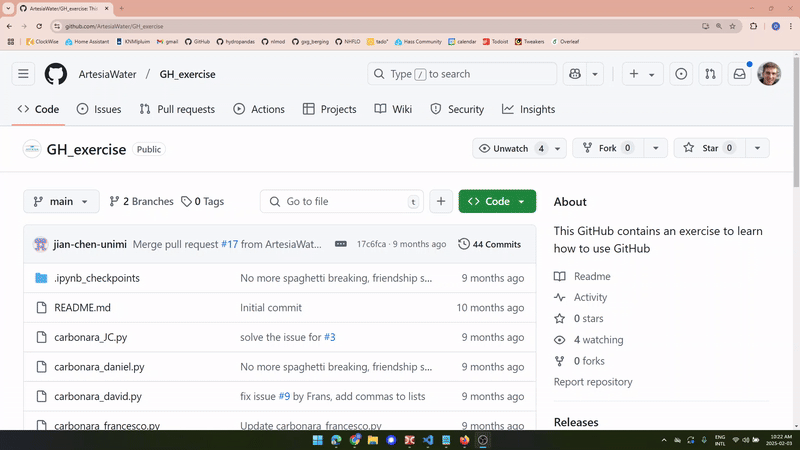
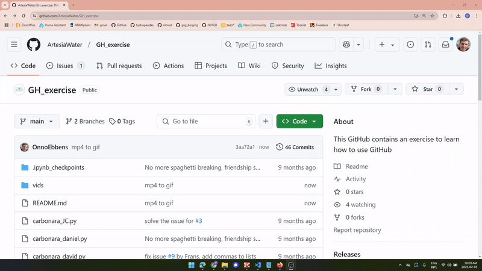
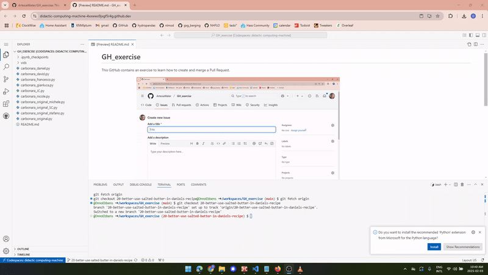
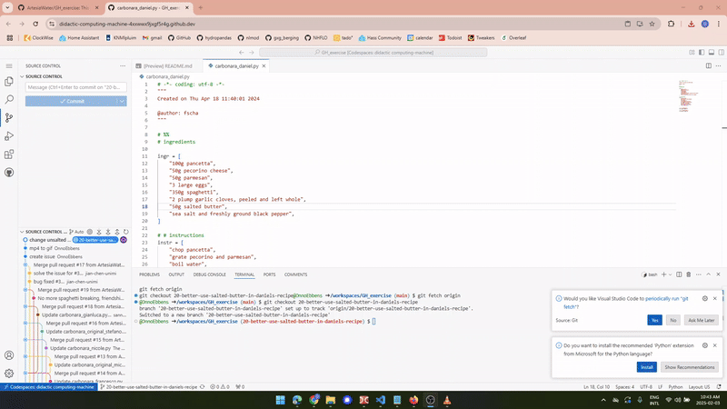
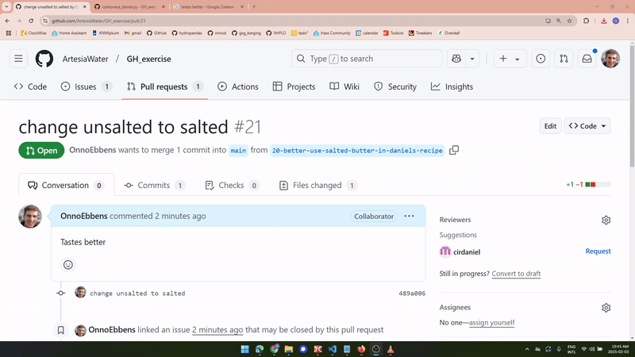

# GH_exercise
This GitHub contains an exercise to learn how to create and merge a Pull Request.

These are the steps you will follow (a gif for each step is shown below):
1. Create an Issue
2. Create a branch from that issue
3. Make a local copy of that branch
4. Modify your code using commits in your branch
5. Create a pull request from your branch
6. Ask someone to review your pull request
7. Merge the code 

#### 1. Create an Issue

#### 2. Create a branch from that issue

#### 3. Make a local copy of that branch

#### 4. Modify your code using commits in your branch

#### 5. Create a pull request from your branch

#### 6. Ask someone to review your pull request

#### 7. Merge the code 
