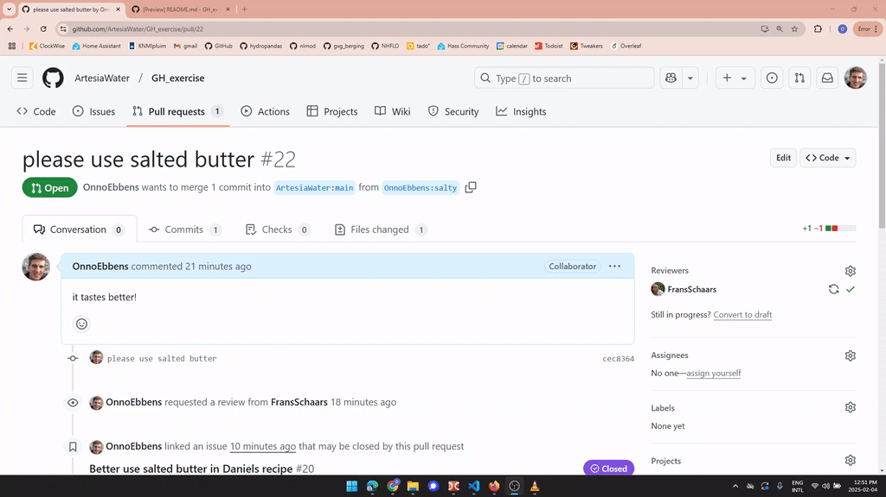

# GitHub Exercise
This repository includes an exercise for learning how to contribute to a project through a Pull Request.

Here are the steps you'll follow (a gif for each step is shown below):
1. Create an Issue
2. Create a fork
3. Make a local copy (or codespace) of your fork
4. Make a new branch
5. Modify your code using commits in your branch
6. Create a pull request from your branch
7. Link your issue (step 1) to your pull request (step 6)
8. Ask someone to review your pull request
9. Merge the code

#### 1. Create an Issue

#### 2. Create a fork

#### 3. Make a local copy (or codespace) of your fork

#### 4. Make a new branch

#### 5. Modify your code using commits in your branch

#### 6. Create a pull request from your branch

#### 7. Link your issue (step 1) to your pull request

#### 8. Ask someone to review your pull request

#### 9. Merge the code 

